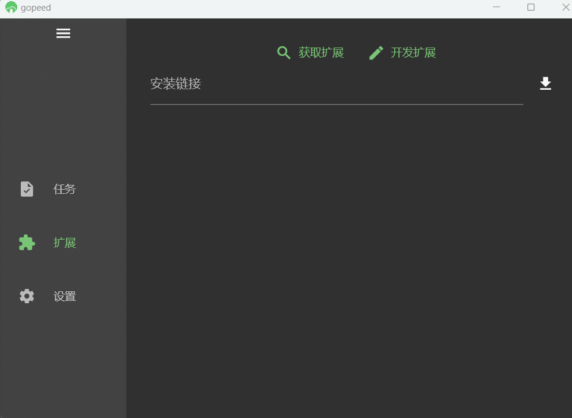
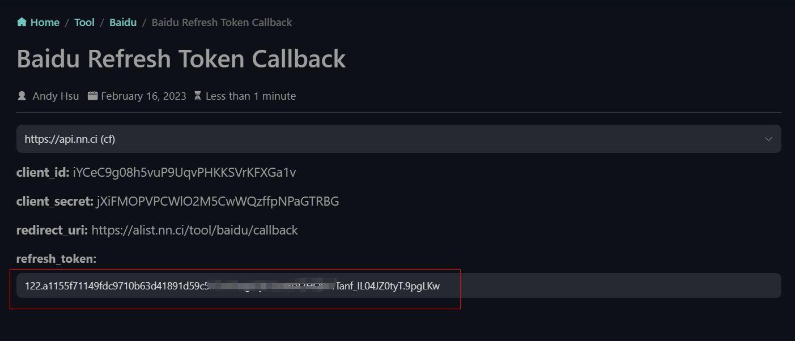
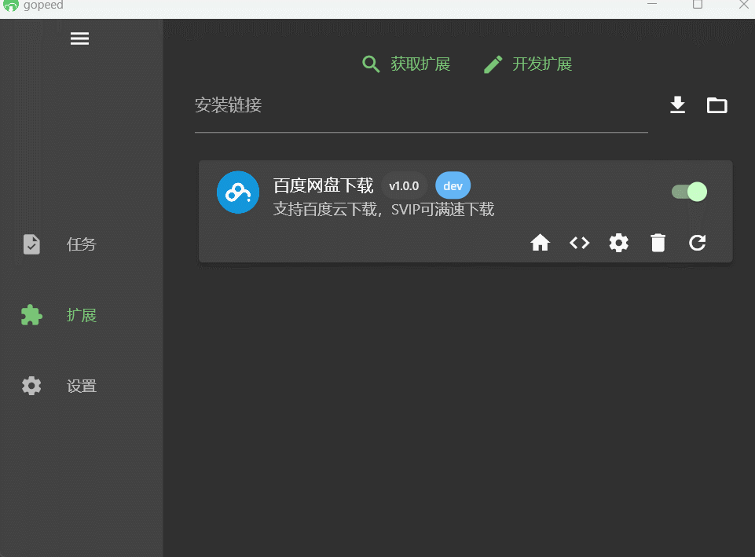
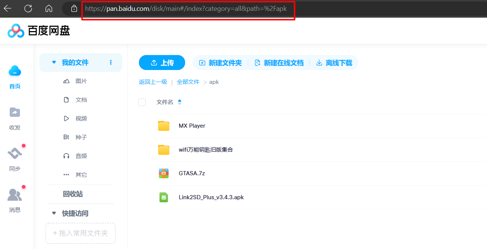
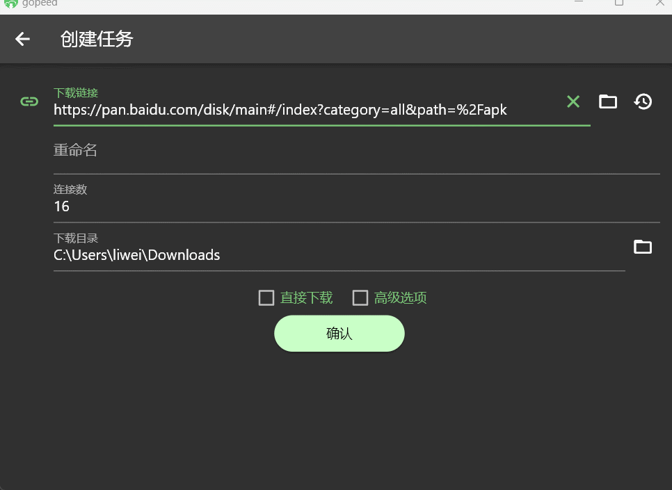
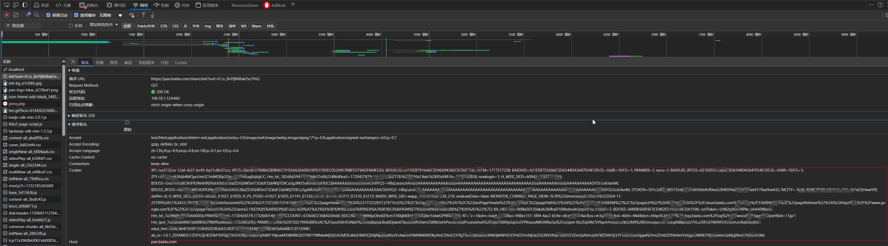
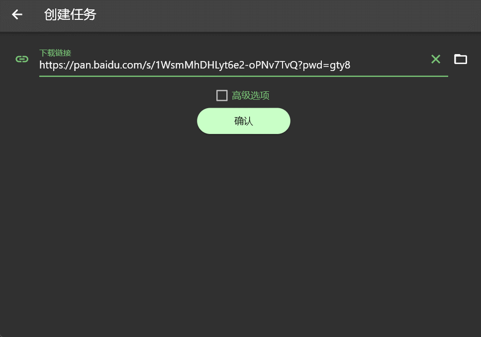

# Gopeed 百度网盘下载扩展

## 声明

项目中所涉及的接口均来自百度官方，不涉及任何违法行为，本工具需要使用自己的百度网盘账号才能获取下载链接，代码全部开源，仅供学习参考；请不要将此项目用于商业用途，否则可能带来严重的后果。

## 安装

打开`Gopeed`扩展页面，输入`https://github.com/monkeyWie/gopeed-extension-baiduwp`，点击安装即可。

## 使用说明

扩展支持两种方式下载百度网盘资源。

### （一） 通过网盘首页地址下载

此方式通过百度网盘开放平台接口实现，需要设置开放平台对应的参数，请参考以下步骤进行配置：

#### 1. 设置 refresh_token

首先要获取对应的`refresh_token`，目前扩展默认设置了`alist`的百度网盘参数，只需要通过此[链接](https://openapi.baidu.com/oauth/2.0/authorize?response_type=code&client_id=iYCeC9g08h5vuP9UqvPHKKSVrKFXGa1v&redirect_uri=https://alist.nn.ci/tool/baidu/callback&scope=basic,netdisk&qrcode=1)来获取你自己的`refresh_token`即可。

接着把复制的`refresh_token`值填入`Gopeed`扩展的设置页面，点击保存即可。

#### 2. 通过网盘首页地址下载

浏览器打开需要下载的百度网盘页面，然后复制浏览器地址栏中的`地址`。

打开`Gopeed`任务页面，点击`新建任务`，创建即可解析下载。

> 注：此方式默认只解析`第一层文件夹里的文件`，这是为了防止文件过多导致解析失败，如果需要解析更多层级的文件夹，请自行在浏览器中进入到对应的文件夹，然后复制地址进行解析下载。

### （二） 通过网盘分享链接下载(此方法已失效)

此方式需要配置百度网盘`Cookie`值，请参考以下步骤进行配置：

#### 1. 设置 Cookie

首先下载之前必须要设置百度网盘登录后的完整`Cookie`，可以通过浏览器的开发者工具获取，打开百度网盘页面，按`F12`打开开发者工具，切换到`Network`选项卡，刷新页面，找到`pan.baidu.com`的请求，复制`请求头`中的`Cookie`值。

#### 2. 通过分享链接下载

打开`Gopeed`任务页面，点击`新建任务`，创建即可解析下载。

> 注：如果有提取码，需要把提取码一起带入到分享链接中，例如：`https://pan.baidu.com/s/1WsmMhDHLyt6e2-oPNv7TvQ?pwd=gty8`

## 说明

百度网盘现在对并发数有做限制，建议下载连接数使用`4`以防止不必要的失败请求，百度网盘普通用户下载速度会比较慢，如果想要提高下载速度，请开通`SVIP`。

## 参考

扩展开发文档：[https://docs.gopeed.com/zh/dev-extension.html](https://docs.gopeed.com/zh/dev-extension.html)
