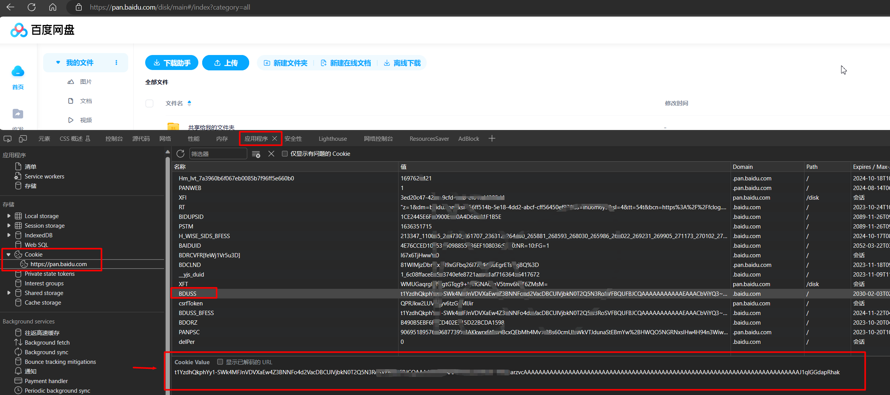
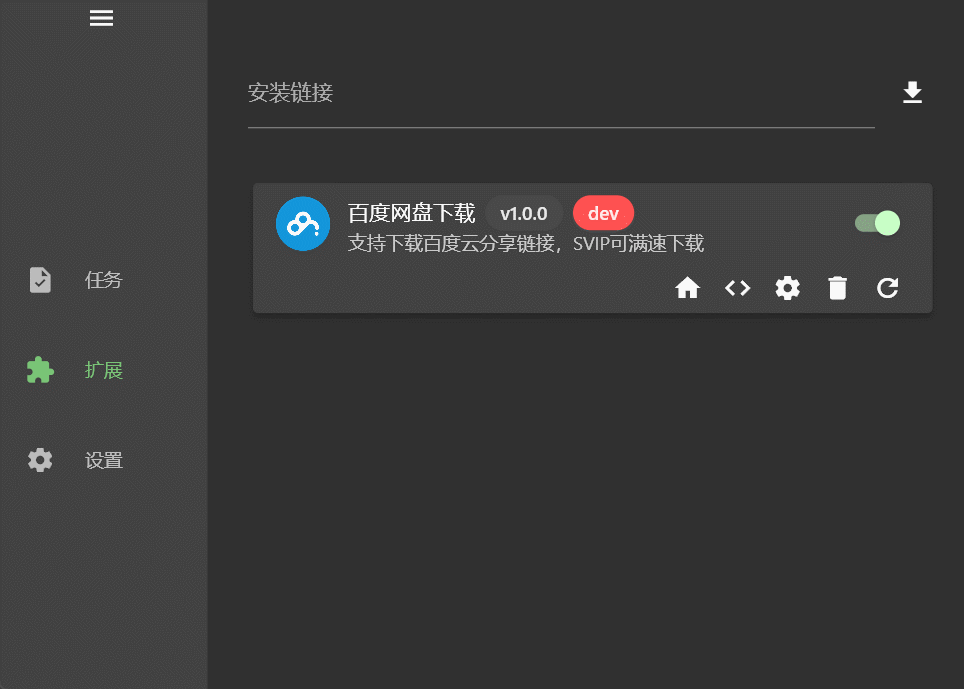

# Gopeed 百度网盘下载扩展

## 声明

项目中所涉及的接口均来自百度官方，不涉及任何违法行为，本工具需要使用自己的百度网盘账号才能获取下载链接，代码全部开源，仅供学习参考；请不要将此项目用于商业用途，否则可能带来严重的后果。

## 安装

打开`Gopeed`扩展页面，输入`https://github.com/monkeyWie/gopeed-extension-baiduwp`，点击安装即可。

## 使用说明

### 1. 设置 BDUSS

首先下载之前必须要设置百度网盘登录后的`BDUSS`，有两种方式可以获取到：

- 方法一：通过浏览器开发者工具，按`F12`打开开发者工具，切换到`Application(应用程序)`选项卡，找到`Cookies`，找到`https://pan.baidu.com`，找到`BDUSS`，复制`Value`的值即可。
  
- 方法二： [参考教程](http://pandownload.net/faq/cookie.html)

接着把复制的`BDUSS`值填入`Gopeed`扩展的设置页面，点击保存即可。

### 2. 通过分享链接下载

打开`Gopeed`任务页面，点击`新建任务`，创建即可解析下载。

> 注：如果有提取码，需要把提取码一起带入到分享链接中，例如：`https://pan.baidu.com/s/1WsmMhDHLyt6e2-oPNv7TvQ?pwd=gty`

## 说明

百度网盘普通用户下载速度会比较慢，如果想要提高下载速度，请开通`SVIP`。

> 扩展开发文档：[https://docs.gopeed.com/zh/dev-extension.html](https://docs.gopeed.com/zh/dev-extension.html)
